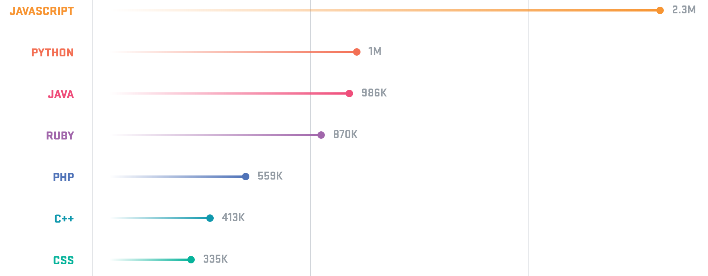

## Autres contraintes

Dans cette partie nous discuterons des contraintes qui ne sont, ni liées au temps, ni liées aux coûts. 

### Ecouter la communauté

Mr. Marklovitz  a déjà réalisé plusieurs projets dans sa carrière. Il sait que le développement prend du temps et peut coûter cher à une entreprise. Il a su avec les années développer un regard critique sur les technologies étant inscrit à plusieurs newsletters, il a pu voir que depuis deux ans, certaines technologies ont pries beaucoup d'essor. Par exemple au cours d'une de ses recherches, il est tombé sur le graphique suivant :

Ce graphique représente les 15 langages les plus populaires sur le plus grand  [service web d'hébergement et de gestion de développement de logiciels](https://github.com). En poussant un peu sa recherche il est allé voir sur Wikipédia et est tombé sur le texte suivant :

> JavaScript est un langage de programmation de scripts principalement employé dans les pages web interactives mais aussi pour les serveurs avec l'utilisation de Node.js.

Source: [Wikipedia](https://fr.wikipedia.org/wiki/JavaScript)

Pouvoir utiliser le même langage et donc le même développeur pour le projet est une économie de temps et de ressources. Le projet devra donc utiliser du JavaScript côté serveur et côté client. Les ressources seront mutualisées. Avoir une seule technologie permet aussi d'alléger la dépendance aux développeurs. En effet si la personne qui travaille sur le projet se retrouve indisponible, il sera plus facile de recruter une personne plutôt que deux. Un aspect intéressant de développer dans la même technologie permet aussi de limiter les problèmes de communications internes à une équipe. Grâce à du développement javascript fullstack, chacun peut intervenir à tous les niveaux.

### Application web, offline first et mobile first

Il n'est pas rare que certains employés de Haas & Milan travaillent sur un réseau non filaire. Ils ont besoin d'accéder à la plateforme via leur smartphone souvent en réseau 2G. L'approche devant être favorisé sera donc [l’offline first](https://blog.buddyweb.fr/zoom-sur-le-offline-first-670f151cb81) en plus d'être [mobile first](https://fr.wikipedia.org/wiki/Site_web_adaptatif).
