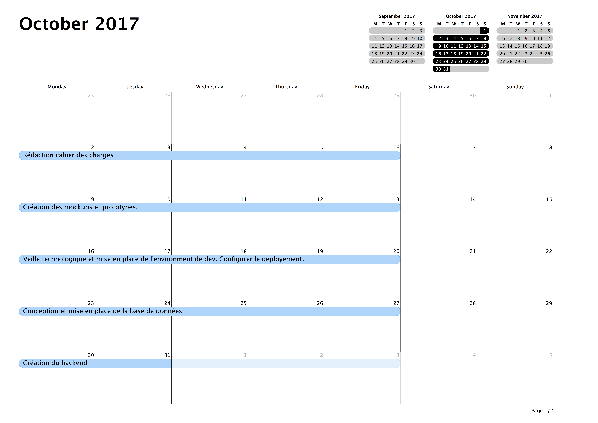
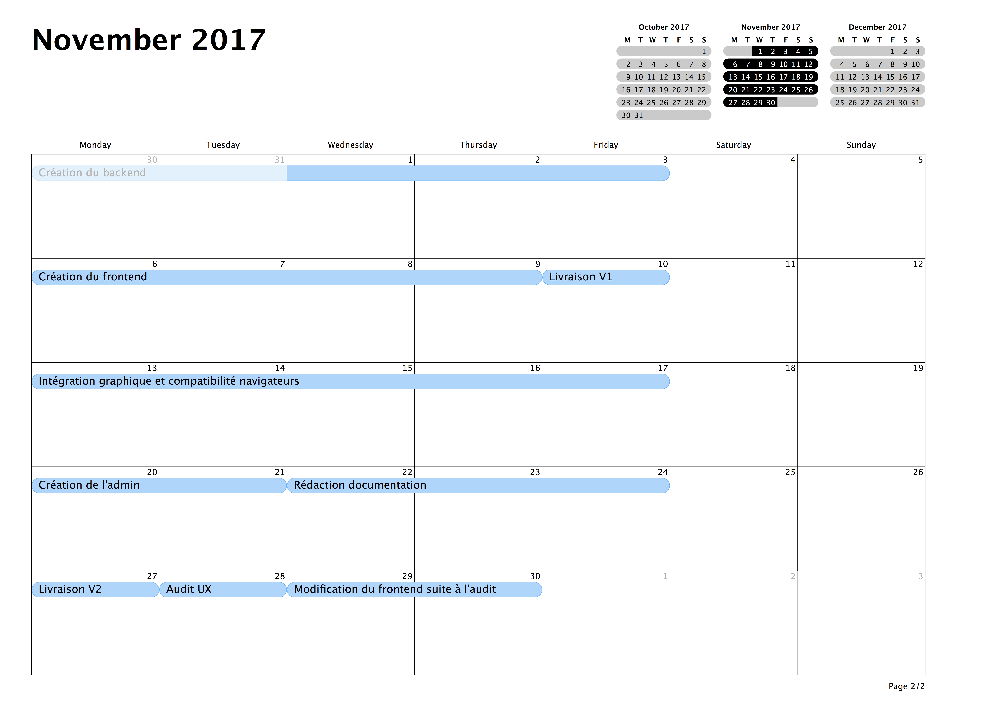

# Déroulement du projet

## Planification

Dans cette partie nous discuterons de l'articulation des grandes phases du projet ainsi que des principaux jalons.

### Lancement du projet

* _Rédaction du cahier des charges:_ La première étape de ce projet est la rédaction du document qui permettra de synchroniser tous les acteurs du projet. Il est nécessaire de savoir définir le besoin du client pour savoir comment y répondre

* _Réalisation wireframe et prototypage: _ Les entreprises aiment voir le résultat avant qu'il soit fini. Si les fonctionnalités sont validées alors le besoin en terme de graphisme doit l’être aussi.

* _Veille technologie et choix du boilerplate:_ Pourquoi utiliser un boilerplate ? Les réponses sont nombreuses et parfois compliqués. Simplement, nous dirons que choisir un boilerplate permet d'éviter bon nombre d'erreurs et d'accélérer le processus de développement.

### Organisation du calendrier

Le calendrier ci-dessous présente les deux premiers mois du projet. Ont été pris pour exemple les mois où le projet a été réalisé.

