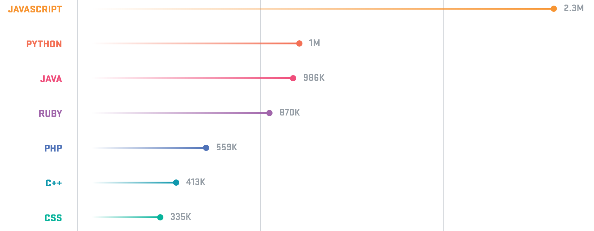

<!-- * Autres contraintes à prendre en compte (normes techniques, clauses juridiques, etc.) -->
* Ecouter la communauté

* Facile de trouver un développeur

* Réseau pas fiable donc application web, offline first et mobile first

* Serveur performance et facile à maintenir.

* Développeur frontend et backend soit le même. 