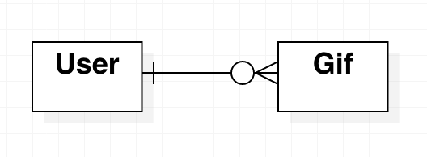
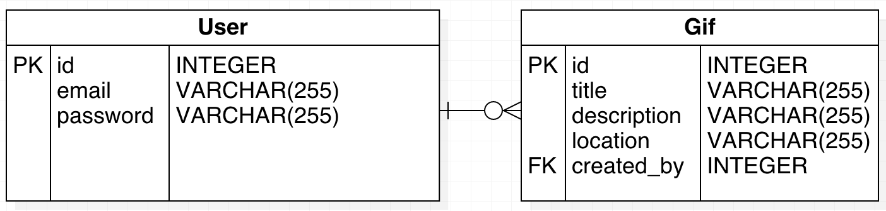

# Concevoir une base de données

Dans cette partie, pour effectuer cette analyse je me suis aidé [des cours](https://www.youtube.com/watch?v=4Z9KEBexzcM&list=PL1LIXLIF50uXWJ9alDSXClzNCMynac38g) de [Dr Daniel Soper](https://www.danielsoper.com/about/default.aspx). [Ils](https://www.youtube.com/watch?v=4Z9KEBexzcM&list=PL1LIXLIF50uXWJ9alDSXClzNCMynac38g) m'ont aidé à structurer cette partie et mieux définir le modèle de données que j'utilise. 

Avant de mettre en place une base de données, il faut être capable de la modéliser. 

## Analyse des besoins

Nous utiliserons [le modèle entité-association](https://fr.wikipedia.org/wiki/Mod%C3%A8le_entit%C3%A9-association) qui nous fournira une description graphique pour représenter notre modèle de données sous forme d'un diagramme contenant les entités et les associations.
  
### Les entités

L'application contient deux [entités](https://youtu.be/kyGVhx5LwXw?t=1m37s) : les gifs et les utilisateurs. Nous les nommerons Gif et User.

### Les relations

La relation entre un gif et un utilisateur est binaire. Un utilisateur crée et poste un gif. Un gif est créé par un utilisateur. Un gif est regardé par un utilisateur. C'est une relation `one-to-many` et nous pouvons la représenter comme ceci :

L'utilisateur est une `strong` entité car il n'a pas besoin d'une autre entité pour exister. Par ailleurs un gif est une entité `weak` car un gif ne peut exister sans un utilisateur. 

### Les attributs 

Les attributs de Gif sont:
* id
* email
* password

Les attributs de User sont:
* id
* title
* description
* location
* created_by

### Les associations

Pour associer un gif à un utilisateur nous utiliserons `created_by` comme clé étrangère qui renvoie à l'id de l'utilisateur.

## Design des composants

Pour designer les tables nous allons nous aider de la reflexion que nous avons menée dans la partie précédente. Commençons par compléter le schéma `one-to-many` avec les attributs, étant encore dans l'implémentation nous continuerons d'utiliser [StarUML](http://staruml.io/):

On notera que le mot de passe ne sera pas sauvegardé sous forme de chaîne de caractères, mais sera ["bcrypté"](https://fr.wikipedia.org/wiki/Bcrypt). De plus, nous prendrons le soin de créer une fonction qui nous permettra de comparer les mots de passe lors de l'enregistrement.

Maintenant que nous avons designer les composants de la base de données, nous pouvons passer à la mise en place de la base de données. 

