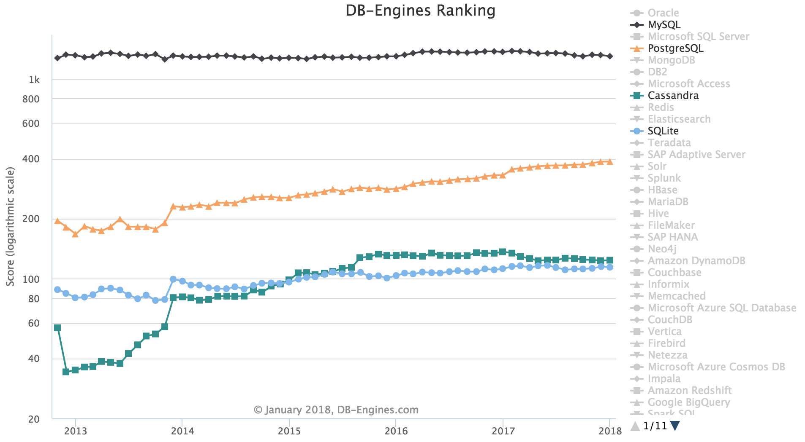
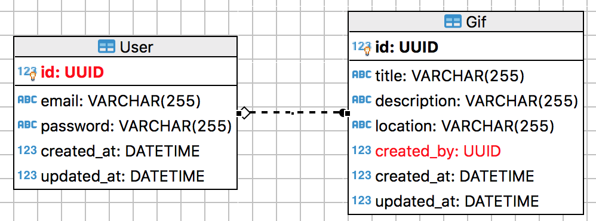

# Mettre en place une base de données

Afin de mettre en place une base de données, j'ai dû faire un choix parmi les différents [systèmes de gestion de bases de données](https://fr.wikipedia.org/wiki/Syst%C3%A8me_de_gestion_de_base_de_donn%C3%A9es) disponibles. Je m'oriente souvent en écoutant la communauté et pour cela je me suis aidé de [db-engines](https://db-engines.com). J'ai pu ainsi voir ce graphique de tendance : 


Nous pouvons déjà enlever les solutions payantes de cette liste à savoir : Oracle, Microsoft SQL Server, DB2, Microsoft Access et Teradata. Pour mon projet j'ai besoin de deux solutions, une première très rapide à mettre en place avec laquelle je peux développer facilement et une deuxième que j'utiliserai en production une fois le prototype de l'application terminé. 

## Présentation des choix

### Sequelize : Mapping Object Relationnel (ORM)

Un [ORM](https://fr.wikipedia.org/wiki/Mapping_objet-relationnel) est une technique qui nous permet de créer une base de données à partir des objets du language utilisés. La critique principale contre les ORM est orientée sur deux points : complexité et performance. En contre partie un ORM offre l'implémentation d'une base de données avec les bonnes pratiques et une réduction du code côté SQL. On pourra retrouver un utilisateur via son `id` comme : 

```js
const Sequelize = require('sequelize')
const sequelize = new Sequelize(config.databaseUrl)
const User = sequelize.define('User', ...)
const user = await User.findById({ id })
```

La même requête en utilisant les templates de chaînes de caractères javascript et Postgres ressemblerai à ceci :

```js
const { Client } = require('pg')
const client = new Client(...)
await client.connect()
const query = `SELECT * FROM "User" WHERE id='#{id}'`
const res = await client.query(query)
const [user] = res.rows
```

Un ORM  tel que Sequelize nous permet de garder la flexibilité de la base de données utilisée (MySQL, Postgres, SQLite, ...) là où l'autre approche nous force à choisir un système et à le garder. De plus Sequelize a une bonne synchronisation avec les bases données, un chargement rapide et il permet les associations et migrations.

Ces différents petits avantages ont orienté mon choix vers l'utilisation de l'ORM Sequelize.

### MySQL, Postgres, Cassandra, SQLite...



MySQL semble être le choix par défaut lorsqu'on regarde ce graphique. D'expérience, j'ai souvent passé du temps à essayer de faire en sorte que MySQL fasse ce que les autres [RDBMS ( ou DBMS)](https://stackoverflow.com/questions/18419137/what-is-the-difference-between-dbms-and-rdbms) font par défaut. Je pense par exemple à l'utilisation de la contrainte `CHECK` qui [ne fonctionne pas](https://stackoverflow.com/questions/2115497/check-constraint-in-mysql-is-not-working) sur MySQL malgré que le mot soit compris. Cassandra offre une grande vitesse d'écriture ainsi qu'un langage de requête proche de SQL nommé 'CQL'. N'ayant pas des besoins en terme de rapidité d'écriture de fichiers, je n'ai pas choisi Cassandra. Les deux options restantes sont Postgres et SQLite et elles conviennent parfaitement à mes besoins. En effet, pour le développement je peux utiliser SQLite (DBMS) et pour la production je peux utiliser Postgres en utilisant des solutions comme [ElephantSQL](https://www.elephantsql.com/) ou [Heroku Postgres](https://www.heroku.com/postgres).

N.B. J'ai fait le choix de ne pas m'orienter vers les technologies NoSQL par manque de connaissances dans ce domaine. 

## Implémentation

Suite au choix des technologies j'ai du implémenter les entités en utilisant Sequelize. 

### Gif

```js
const Gif = Model.define(
  'Gif',
  {
    id: {
      type: DataType.UUID,
			defaultValue: DataType.UUIDV1,
      primaryKey: true,
    },
    title: {
      type: DataType.STRING(255),
    },
    description: {
      type: DataType.STRING(255),
    },
    location: {
      type: DataType.STRING(255),
    },
    created_by: {
      type: DataType.UUID,
    },
  }
)
```

### User

```js
const User = Model.define(
  'User',
  {
    id: {
      type: DataType.UUID,
      defaultValue: DataType.UUIDV1,
      primaryKey: true,
    },
    email: {
      type: DataType.STRING(255),
      validate: { isEmail: true },
    },
    password: {
      type: DataType.STRING,
      allowNull: false,
    },
  }
```

Pour des raisons de sécurité, ne pouvant pas stocker le mot de passe de l'utilisateur sous forme de chaîne de caractères, nous devons donc [hasher](https://fr.wikipedia.org/wiki/Fonction_de_hachage) le mot de passe. Voici la méthode pour générer le hash :

```js
User.prototype.generateHash = pwd => bcrypt.hash(pwd, bcrypt.genSaltSync(8));
```

et la méthode pour comparer les mots de passe pour l'identification de l'utilisateur :

```js
User.prototype.validPassword = function validPassword(pwd) {
  return bcrypt.compare(pwd, this.password);
};
```

Suite à cette implémentation, on peut observer grâce à [Dbeaver](https://dbeaver.jkiss.org/) le diagramme des tables :

