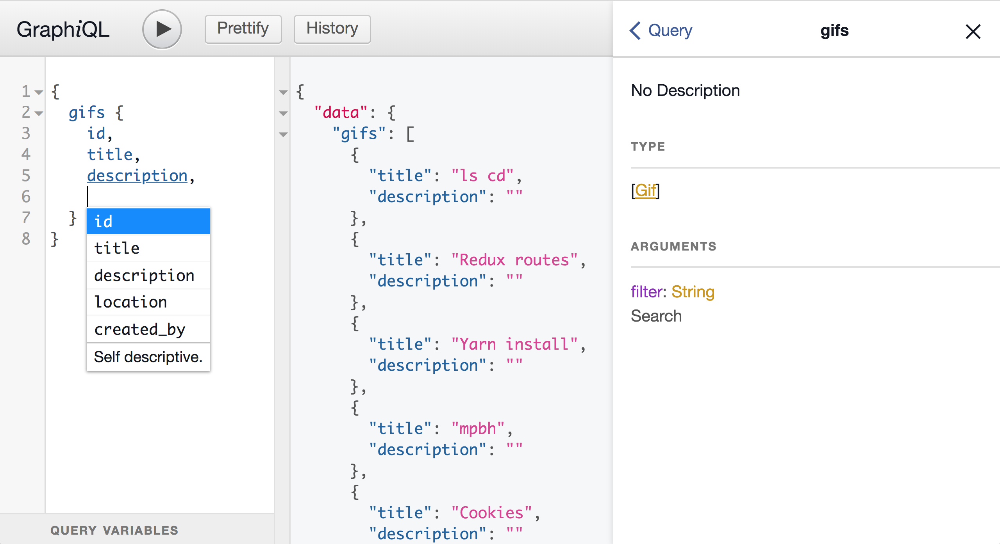
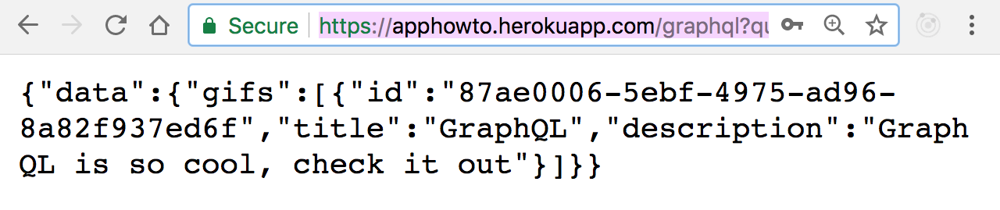

# Développer des pages web en lien avec une base de données

## GraphQL

Pour développer des pages en lien avec la base de données, j'ai mis en place un serveur [GraphQL](https://fr.wikipedia.org/wiki/GraphQL) qui "propose une alternative aux [REST API](https://fr.wikipedia.org/wiki/Representational_state_transfer)". Un serveur GraphQL n'est pas nécessaire pour l'accès aux données mais il a grandement facilité le développement de l'application.    GraphQL a certaines fonctionnalités qui facilitent énormément le développement du frontend :

* Interface dans le navigateur qui permet de tester les requêtes
* Autocomplétion
* Documentation sur le type de données et les arguments
* Une seule requête permet d'obtenir différents types de données sous forme de JSON.

J'ai essayé d'illustrer ces fonctionnalités sur cette impression écran :



Nous pouvons voir :
* Sur la gauche [l'IDE](https://fr.wikipedia.org/wiki/Environnement_de_d%C3%A9veloppement) avec l'autocomplétion proposant les champs acceccibles, 
* Au centre le résultat de la requête sous la clé `data`, plus besoin d'outils tel que [postman](https://www.getpostman.com/) pour tester ses API,
* A droite la documentation des données disponibles.

De plus si un problème est détecté en production on pourra très facilement tester les requêtes comme suit :



Ceci peut faciliter la résolution bugs.

## "Fetcher" les données

Depuis 2015 nous pouvons utiliser l'API `fetch`. D'après [MDN](https://developer.mozilla.org) : 

> "L'API Fetch fournit une interface pour la récupération de ressources. Elle paraîtra familière à tout utilisateur de XMLHttpRequest, mais cette nouvelle API propose néanmoins un ensemble de fonctionnalités plus souples et plus puissantes." [Source](https://developer.mozilla.org/fr/docs/Web/API/Fetch_API)

Le déclencheur de l'appel de données est le router. Une fois la route demandée, une requête de type `fetch` est effectuée. Nous pouvons par exemple regarder comment sont "fetchées" les données sur la page Home :

```js
const query = '{gifs {id,title,description,location,created_by}}'
  const resp = await props.fetch('/graphql', {
    body: JSON.stringify({
      query,
    }),
  })
  const { data } = await resp.json()
```

Utilisant [React](https://reactjs.org/), je peux ensuite insérer ce `data` comme props dans le composant qui affiche la page. 