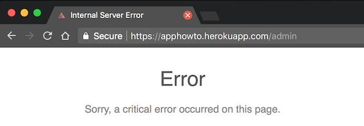
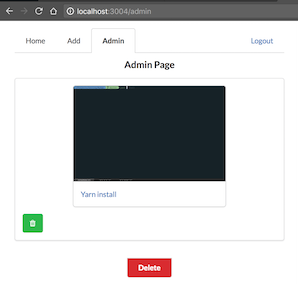

# Développer des composants d'accès aux données

Pour accéder aux données, j'ai réalisé une page administrateur sécurisée. Sur cette page, il est possible de supprimer plusieurs gifs à la fois. 

## Gestion de l'admin

Pour authentifier un utilisateur, admin ou pas, je vérifie la validité d'un token dans les cookies. Grâce au package `jsonwebtoken`, l'authentification est gérée par JSON Web Token. Ainsi j'utilise le package `express-jwt` pour générer un token que je place dans les cookies :

```js
const expiresIn = 60 * 10; // 10min
const token = jwt.sign(req.user, config.auth.jwt.secret, { expiresIn })
res.cookie('id_token', token, {
	maxAge: 1000 * expiresIn,
  httpOnly: true, // Protect cookie on the client side
})
```

Suite à chaque requête, je vérifie ensuite la validité du token dans les cookies avec le package `express-jwt` :

```js
app.use(
  expressJwt({
    secret: config.auth.jwt.secret,
    credentialsRequired: false,
    getToken: req => req.cookies.id_token,
  }),
);
```

Un utilisateur est administrateur s'il passe le test suivant :

```js
const isAdmin = req.user.email === process.env.ADMIN_EMAIL;
```

On notera ici l'utilisation de `process.env`. L'objet `process` est un objet global qui fournit des informations sur le processus `node` en cours. Le `.env` vient du package [`dotenv`](https://github.com/motdotla/dotenv). Ce package permet d'avoir une variable telle que `process.env.ADMIN_EMAIL` côté serveur. Ces variables ne sont pas ajoutées à `git` et sont présentes dans un fichier `.env` sous le format : 

```shell
ADMIN_EMAIL=foo.bar@admin.com
ADMIN_EMAIL_1=baz.qux@admin.com
```

Ce fichier sera ajouté manuellement à la production et pourra être édité si besoin. Maintenant que l'admin est géré côté backend, il faut un système qui permet d'afficher une page admin côté client. Pour effectuer cette tâche je me suis inspiré des `devtools` de Chrome, quand on navigue dans les préférences de `devtools` onglet `Expiriments` et qu'on appuie sur la touche `shift` sept fois, on fait apparaître des options supplémentaires. Sur `HowTo`, pour faire apparaître l'admin j'ai utilisé la même logique : 

```js
componentDidMount = () => {
  document.body.addEventListener('keyup', this.onKeyUp) // Reveal admin link
};

onKeyUp = evt => {
  const { count } = this.state;
  if (evt.keyCode === 16) {
    if (count > 7) this.setState({ showAdminLink: true })
    else this.setState({ count: count + 1 })
  }
}
```

Je crée un "event listener" qui va se déclencher dès qu'une touche du clavier est relâchée, si cette touche est la touche `shift` on incrémente un compteur. De plus, un utilisateur mal intentionné trouvera porte clause s'il tente d'entrer l'url `/admin` manuellement.



## Page admin

L'utilisateur ayant les droits administrateurs pourra accéder à la page administrateur. Il pourra ainsi supprimer du contenu en cliquant sur plusieurs icônes corbeilles et en validant ce choix en cliquant le bouton `Delete`. 

