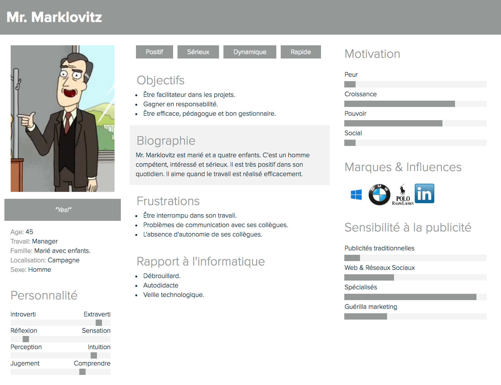

### UX Design

#### Audit UX

Afin d'améliorer l'expérience utilisateur, j'ai décidé de réaliser un audit UX de **HowTo** avec Sonia notre formatrice d'UX. Suite à cette audit elle m'a invité à réaliser des personas. 

#### Création de personas

**HowTo** a deux cibles. La première de c'est cible s'appellera Jerry Smith. Il représente l'employé classique de Haas & Milan qui empêche Mr. Marklovitz de travailler. Jerry est le persona primaire, il devra être amené à utiliser le gif afin de donner du temps Mr. Marklovitz. Le persona secondaire est Mr. Marklovitz, il est celui qui va téléverser les gifs. L'objectif principal est de satisfaire le persona primaire.

##### Persona primaire

##### Persona secondaire

