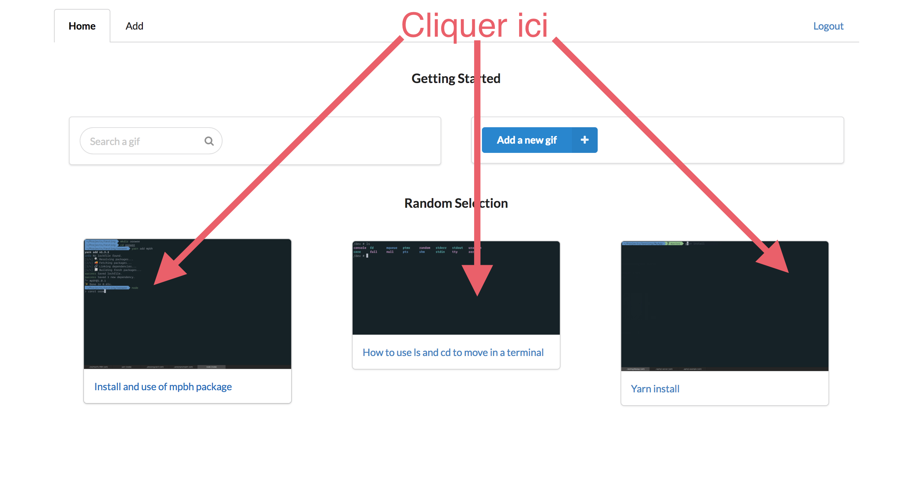

# Notice d'utilisation

Dans cette partie, nous présenterons la documentation de l'application. Nous montrerons deux approches, une première pour un public voulant utiliser la plateforme pour regarder du contenu et une deuxième pour un public plus averti voulant téléverser des gifs. 

# Pour commencer

Pour visionner vous avez deux possibilités : 

* Cliquer sur un élément de la page d'accueil.
* Faire une recherche par mot clé.

La première option est la plus simple, tout d'abord il faut se rendre sur la page `Home` en cliquant sur le texte Home dans la barre navigation.

Puis cliquer sur un gif :

La deuxième option est la recherche par mot clé. Pour réaliser cette recherche cliquer dans le champ recherche : 

Puis commencer à taper un mots clé. Des propositions vous seront suggérées. 

> Si suite à votre recherche les mots `No result found` apparaissent cela signifie qu'aucun résultat n'a été trouvé dans le titre et dans la description des gifs présents en base de données.

# Guide avancé	

Dans ce guide nous apprendrons comment téléverser des gifs. Tout d'abord assurez vous d'avoir un gif à disposition. Afin de vérifier que l'extension du fichier est la bonne vous pouvez regarder dans :

* _Propriétés pour les utilisateurs de Windows :_ Clic droit puis propriétés ou `alt` + `enter`. 
* _Informations pour les utilisateurs Macintosh :_ Clic droit puis lire les informations ou `cmd` + `i`.

Dans les deux cas le "type" du fichier doit être gif. 

Maintenant que nous sommes sûrs que nous avons un gif à téléverser, nous pouvons nous rendre sur la page d'accueil de l'application `Home` puis naviguer sur l'onglet `Login`

Si vous possédez un compte, vous pouvez vous enregistrer directement, sinon il vous faut créer un compte en cliquant sur `Signup`. Taper un courriel valide aussi qu'un mot de passe. 

Si la création de compte ou l'enregistrement du compte fonctionne, vous serez redirigé vers l'onglet `Add` en vue de sélectionner le gif que vous voulez téléverser. Cliquer sur le grand carré noir, une fenêtre système vous permettant de sélectionner le gif apparaîtra. Sélectionner le gif puis ajouter un titre dans le champ `title`. Vous pouvez optionnellement ajouter une description. Pour commencer le téléversement cliquer sur `Submit`. Dans le cas où le téléversement a fonctionné, vous serez redirigé vers une vue ou vous verrez votre gif prendre approximativement toute la largeur de l'écran. 

